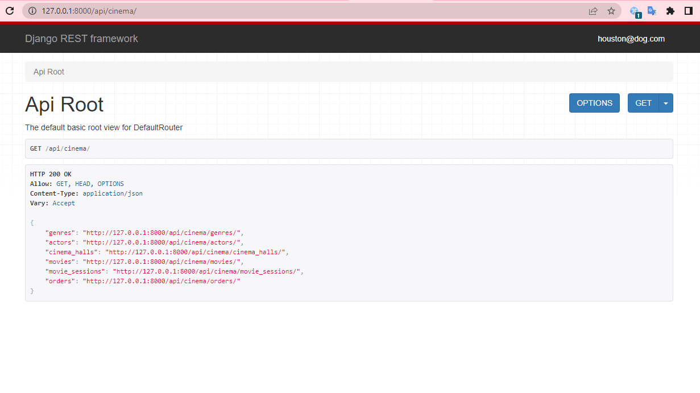

# Cinema API
> API is a huge usability win for your developers.

API service for cinema management. Written on Django REST Framework.



## Installing
To begin you need to create a DB in PostgresSQL.

```shell
git clone https://github.com/anastasia-martyniuk/cinema-DRF
(python -m venv venv
source venv/Scripts/activate) Windows OS
(python3 -m venv venv
source venv/bin/activate) MAC OS
pip install -r requirements.txt
set DB_HOST=your db hostname
set DB_NAME=your db name 
set DB_USER=your db username
set DB_PASSWORD=your db user password
set SECRET_KEY=your secret key
python manage.py migrate
python manage.py runserver
```

Docker should be installed and activated.

```shell
docker-compose build
docker-compose up
```

## Getting access
* create user -> /api/user/register/
* get access token /api/user/token
* Use ModHead for your browser:
  
    create request header (Authorization Bearer your access token)

## Features

What's all the bells and whistles this project can perform?
* Powerful admin panel -> /admin/
* Complete documentation -> /api/doc/swagger/ or /api/doc/redoc/
* You can register -> /api/user/register/ and get a token -> /api/user/token/
* Creating genres, actors, cinema halls, movie with genres and actors, movie session with movie and cinema hall, order with tickets
* Adding image to movie -> /api/cinema/movie/pk/
* Managing orders and tickets
* Filtering movies and movie sessions
